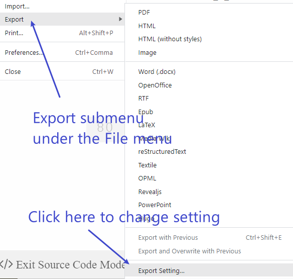
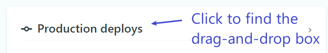
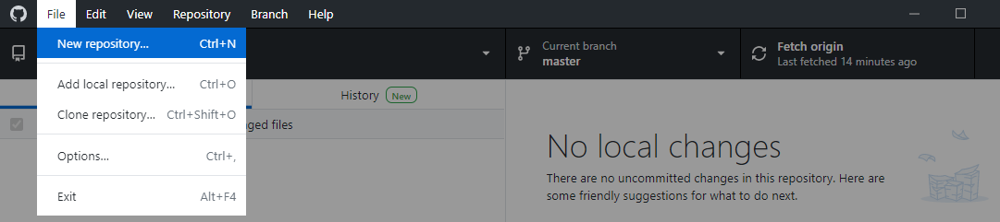
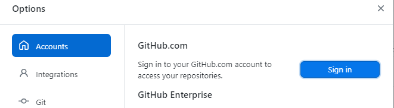

## Installing Typora and Pandoc

- Download (old version) Typora from [https://typora.io/releases/all](https://typora.io/releases/all) and install Typora.

- Download Pandoc from [https://github.com/jgm/pandoc/releases/tag/2.16.1](https://github.com/jgm/pandoc/releases/tag/2.16.1)
and install Pandoc.

- Alternatives of Typora

  - [Panwriter](https://panwriter.com/): focusing on the writing experience and calling pandoc.
  - [Visual Studio Code](https://code.visualstudio.com/Download):  lightweight but powerful source code editor with a lot of extensions. 
  - [Lite XL Editor](https://lite-xl.github.io/): fast and lightweight text editor that is highly extendable.

## Part I: Markdown

## Headers

Headers start with `#`.

::::::::: {.row} :::::::

::: {.column}
```markdown
# This is an H1

## This is an H2

#### This is an H4
```
:::

:::: {.column}

::: {.header style="text-algin: left !important;"}
# This is an H1
### This is an H3
#### This is an H4
:::

::::

:::::::::::::::::

## Emphasis

Markdown treats asterisks `*` and underscores `_` as indicators of emphasis. Text wrapped with one `*` or `_` will be displayed in italic style. Text wrapped with two `**` or `__` will be displayed in bold style. Those two styles can be used together.

:::::::::: {.row} ::::::::

::: {.column}

``` markdown

*This text is in italic style*

**This text is in bold style**

***This text is in bold italic style***

```

:::

::: {.column}

*This text is in italic style*

**This text is in bold style**

***This text is in bold italic style***

:::

:::::::::::::::::::::

## Quotes

Blockquotes start with `>`

::::::::: {.row} :::::::

::: {.column}
```markdown
> This is a blockquote with two paragraphs. 
> This is first paragraph.
>
> This is second paragraph.


> This is another blockquote with one paragraph. 
> There are three empty lines that separate two blockquotes.
> 
```
:::

::: {.column}
> This is a blockquote with two paragraphs. 
> This is first paragraph.
>
> This is second paragraph.


> This is another blockquote with one paragraph.
> There are three empty lines that separate two blockquotes.

:::

::::::::::::

## Lists

Typing `*`, `+`, or `-` at the beginning of the list items will create an unordered list.

Typing 1. at the beginning of the list items will create an ordered list.

::::::: {.row} ::::

::: {.column}

```markdown
- Color
  + Green
  * Blue
    1. Sky
    2. Moon
    1. Car
```

:::

::: {.column}

- Color
  + Green
  * Blue
    1. Sky
    2. Moon
    1. Car

:::

::::::::::::::::::

## Tables

In Markdown, a table must contain a row of headers that are separated by `|` which is know as the pipe operator. The second row is in the form `|---|---|` and can be used to adjust alignment. Table contents are placed in the third row and after. By default, table contents are left aligned. Columns of data or header are separated by pipe symbol `|`.

```markdown
| First Header | Second column | Left Aligned | Center Aligned | Right Aligned |
|--------------|---------------|:-------------|:--------------:|--------------:|
| Content      | cells         | *left*       |  **centered**  |   ***right*** |
| Row          | Two           | data 21      |    cell D2     |       cell E2 |
```

| First Header | Second column |  Left Aligned    | Center Aligned     |  Right Aligned    |
| ------------ | ------------- | :---- | :----: | ----: |
| Content  | cells |  *left*  |   **centered**   | ***right*** |
| Row | Two  | data 21 | cell D2 | cell E2 |

## Links

To create a URL link, enclose the link text in brackets`[]` and the URL in parentheses `()`. For an internal link, the URL can be a header identifier `#sectionidentifier` which should be placed in braces `{}` after the section title.

To quickly turn a URL or email address into a link, enclose it in angle brackets `<>`.

::::::::::::::{.row} ::::::

::: {.double-column}

```markdown
[This link](http://example.net/ "title") has a title attribute.

[This link](http://example.net/) has no title attribute.

<https://app.netlify.com/drop>

<FLast@school.edu>

[Go to next slide](#image)
```
:::

::: {.column}

[This link](http://example.net/ "title") has a title attribute.

[This link](http://example.net/) has no title attribute.

<https://app.netlify.com/drop>

<FLast@school.edu>

[Go to next slide](#image)

:::

:::::::::::::::

## Reference and Footnotes

Reference-style links use a second set of square brackets instead of parentheses.

One can create reference footnotes like reference-style links but only keeps the label.

::::::::::::::{.row} ::::::

::: {.column}

```markdown

This is [an example][label] reference-style link. 
The link label can be placed in a new line 
in anywhere of the document like this:

[label]: http://example.com/  "Optional Title Here"

This sentence has a footnote[^fn1].

[^fn1]: Content of the footnote.

```

:::

::: {.column}

This is [an example][label] reference-style link. The link label can be placed in a new line in anywhere of the document like this:

[label]: http://example.com/  "Optional Title Here"

This sentence has a footnote[^fn1].

[^fn1]: Content of the footnote.

:::

:::::::::::::::

## Images {#image}

To add an image, add an exclamation mark `!`, followed by alt text in brackets, and the path or URL to the image asset in parentheses.
One can optionally add a title after the URL in the parentheses.
In Pandoc Markdown, one can change the image size by wrapping the style in `{}` after the URL parentheses.

::::::::::::::{.row} ::::::

::: {.column}

```markdown


{width=25%}
```

{width=25%}

:::

::: {.column}

{height=400px}

:::

:::::::::::::::

## Inline Codes

To denote a word or phrase as in-line code, enclose it in backticks `` ` ``.

If the code includes one or more backticks, one can escape them by enclosing the code in double backticks `` `` ``

::::::: {.row} ::::::

::: {.column}

```markdown
Use `*` to emphasis.

``Use `code` in Markdown``
```
:::

::: {.column}

Use `*` to emphasis.

``Use `code` in Markdown``

:::

:::::::::::::::::::::::::::::::

## Code Blocks

To create code blocks, wrap the codes by three backticks `` ``` ``.

If the code block includes one Markdown code block, one can escape them by enclosing the code code block in quadruple  backticks `` ```` ``

::::::: {.row} ::::::

::: {.column}

``````markdown
```css
.row {
  display: flex;
  flex-direction: row;
  flex-wrap: wrap;
  width: 100%;
}
```
````````
:::

::: {.column}

`````
````markdown
```css
.column {
  display: flex;
  flex-direction: column;
  flex-basis: 100%;
  flex: 1;
}
```
````
`````
:::

:::::::::::::::::::::::::::::::

## Math Blocks

In html, LaTeX mathematical expressions can be rendered using MathJax.

In Markdown, in-line math is a LaTeX expression wrapped by a pair of single `$` sign. Display math block is a LaTeX expression wrapped by a pair of double `$$` marks.

::::::::::::: {.row} ::::::

::: {.double-column}

```latex
This is an inline math $f(x)=x^2+1$.

$$
\mathbf{V}_1 \times \mathbf{V}_2 =  \begin{vmatrix}
\mathbf{i} & \mathbf{j} & \mathbf{k} \\
\frac{\partial X}{\partial u} &  \frac{\partial Y}{\partial u} & 0 \\
\frac{\partial X}{\partial v} &  \frac{\partial Y}{\partial v} & 0 \\
\end{vmatrix}
$$
```

:::

::: {.column}

This is an inline math $f(x)=x^2+1$.

$$
\mathbf{V}_1 \times \mathbf{V}_2 =  \begin{vmatrix}
\mathbf{i} & \mathbf{j} & \mathbf{k} \\
\frac{\partial X}{\partial u} &  \frac{\partial Y}{\partial u} & 0 \\
\frac{\partial X}{\partial v} &  \frac{\partial Y}{\partial v} & 0 \\
\end{vmatrix}
$$

:::

:::::::::::::::::::

one can find more details in the page [Math and Academic Functions](https://support.typora.io/Math/).

## Emoji

In most cases, one can simply copy an emoji from a webpage into your document.

You may also insert emoji by typing emoji shortcodes. These begin and end with a colon `:` and include the name of an emoji.

:::::::: {.row} ::::::
::: {.column}
```markdown
I :heart: Markdown.

It can be used to write :books:.
```
:::

::: {.column}

I :heart: Markdown.

It can be used to write :books:.

:::

:::::::::::::

<!-- ## Definition List

Some Markdown processors, such as Pandoc, allow you to create definition lists of terms and their corresponding definitions. To create a definition list, type the term on the first line. On the next line, type a colon followed by a space and the definition.

::::::: {.row} :::::::

::: {.double-column}

```markdown
Definition

: Let $x$ be a real number.
: The function $f(x)=x^2+1$ is called a ***quadratic function***.

Theorem

: For any real number $x$, the following identity holds true.
: $$\sin^2x+\cos^2x=1.$$
```

:::

::: {.column}

Definition

: Let $x$ be a real number, the function $f(x)=x^2+1$ is called a ***quadratic function***.

Theorem

: For any real number $x$, the following identity holds true.
: $$\sin^2x+\cos^2x=1.$$

:::

::::::::::::::::: -->

## Part II: Typora and Pandoc

## Using Typora

- Typora provides the WYSIWYG mode (default) and source code mode. To switch, one can use the keyboard short cut `ctrl+/` (`cmd+/` on mac).

- Typora supports the user to export current document into PDF, HTML, HTML (without styles) and Image format.

- More formats such as Word, LaTeX, PowerPoint, and Slides are supported via Pandoc.

- To export the current document into a target format, go to the submenu `Export` under the menu `File` and choose the command to run.

## New Export Functions from Templates

:::::: {.row}

::: {.double-column}

1. Find and open the export setting dialog.
2. Click the “add (+)” button in the list panel.
3. Select **Pandoc** from the dialog.
4. Set a name and config its details. For example,
    - for PowerPoint, we can simply fill in the `Target File Extensions` box with `.pptx`,
    - for html slides using revealjs, we fill in the Target Format box with `revealjs` and `Target File Extensions` box with `.html`.

:::

::: {.column}

{width="70%"}

:::

:::::::

## New Custom Export Functions

::::::: {.row}

::: {.double-column}

1. Find and open the export setting dialog.
2. Click the “add (+)” button in the list panel.
3. Select **Custom** from the dialog.
4. Fill in the Command box with a command. For example,
    - to export to revealjs slides using Pandoc, enter the command `pandoc -f markdown+fenced_divs ${currentPath} -s -o ${outputPath} -t revealjs --highlight-style=espresso --mathjax`.
    - to open the Windows `cmd` console, enter `start cmd`.
    - to open the MacOS `terminal` console, enter `open -a terminal`.
:::

::: {.column}

{width="70%"}

:::

::::::

## Exporting to PDF using LaTeX

1. Install a pdf-engine. Recommendation: [Tectonic](https://tectonic-typesetting.github.io/book/latest/installation/#pre-built-binary-packages) which is "a modernized, complete, self-contained TeX/LaTeX engine powered by XeTeX and TeXLive". For Windows user, the msvc version is better.
2. The "PDF (LaTeX / Pandoc)" from template selector is not working.
3. Create a new one using pandoc by filling in the Target Format box with `pdf`, `Target File Extensions` box with `.pdf` and the Extra Arguments box with `tectonic`.

## Using Pandoc

- The basic usage of Pandoc is
  ```bash
  pandoc inputfile -o outputfile
  ```

  The `-o` option is neseccery for output to a file.

- By default, Pandoc produces a document fragment. To produce a standalone document (e.g. a valid HTML file including `<head>` and `<body>`), use the `-s` or `--standalone` option.

  **Example:**

  ```
  pandoc -s input.txt -o output.html
  ```

- Options of pandoc can also be store in a yaml file and use the `-d FILE` or `--defaults=FILE` options in command line to convert. See the pandoc manual [Default Files](https://pandoc.org/MANUAL.html#default-files) for more information.

## Part III: Creating and Publishing Websites

## Installing Hugo

The latest version of Hugo can be downloaded from <https://github.com/gohugoio/hugo/releases>.

You may install it to any folder and add the `hugo.exe` executable to your PATH.

- On Windows, <https://gohugo.io/getting-started/installing/#windows>

- On MacOS, <https://gohugo.io/getting-started/installing/#macos>

To avoid configuration, you may also install it into the website project folder.

## Creating a New Hugo Site

The simplest way to start a hugo site is to copy the sources of a existing website and modify it. For example, you may download the [source code on github](https://github.com/hakyimlab/web-homepage) of the website <https://hakyimlab.org/project/>. This website uses the Hugo theme: [Hugo Prose](https://github.com/yihui/hugo-prose) which I will also use to introduce Hugo.

A second way is to use Hugo to create an empty New site. This can be done using the command

```bash
hugo new site --force FOLDERNAME
```

## A Few Hugo Themes for Personal Websites

- <https://github.com/yihui/hugo-prose>
  
  A Hugo theme derived from the XMin theme, and inspired by Wowchemy, Distill, and tufte.css

- <https://github.com/hugo-apero/hugo-apero>
  
  Apéro is a Hugo theme for personal websites

- <https://github.com/ojroques/hugo-researcher>

  A simple monospaced resume theme for Hugo.

## Content Folder Structure

The `content` folder is where `Hugo` look for Markdown files and convert them into html. Different themes may prefer different structure. For the theme `Hugo Prose`, you may structure the `Content` folder as follows:

```bash
+---YOUR WEBSITE FOLDER
|   ...
|   +---content
|   |   \---_index.md
|   |   \---about.md
|   |   ...
|   |   +---Research
|   |   |   \---_index.md
|   |   +---Teaching
|   |   |   \---_index.md
|   |   +---Post
|   |   ...
              
```

## YAML in Markdown

[YAML](https://en.wikipedia.org/wiki/YAML) plays the role of a database for a Markdown file. There are variables with values which can be used to add features to the output.

In each `_index.md` files you may specify the title and order that page appears in the header by adding

```yaml
---
title: Teaching
menu:
  header:
    weight: 3
---
```

You may also copy the folders and files in the `exampleSite` folder to the `Root of the project` folder, and then modify them.

## Site Configuration

Find the `config.yaml` file in the directory

```bash
+---Root of the project
|   ...
|   +---theme
|   |   +---Hugo-Prose
|   |   |   +---exampleSite
|   |   |   |   ...
|   |   |   |   \---config.yaml
```

Copy it to `Root of the project`.

Open `config.yaml` and change `title: "Hugo Prose"` to `title: "TITLE OF YOUR WEBSITE"`

## Site Configuration (Cont'd)

If you use different folder names and titles of index pages, you may also want to change the folder name in `mainSections: ["post", "work"]` to appropriate folder names.

one can also increase the length of summary and enable emojis by adding the following lines below `params:`.

```yaml
summaryLength: 1000
enableEmoji: true
```

Make sure to align those two lines with other lines below `params:`.

## Practice: Structure Content Folder

1. In the `Content` folder create new folders with `_index.md` files
2. Open the file `_index.md` in the `Content` folder and subfolder, and add the following `yaml` section to the tope of the file. For example,
   ```yaml
   ---
   title: Home
   menu:
     header:
       weight: 1
   ---
   ```
3. Copy the file `about.md` from `exampleSite` folder to the`content` folder under your project root.

## Previewing and Building

- The command for previewing is `hugo server`.

- The command for building is simple `hugo`.

Hugo will generate the website in the `public` folder.

In Windows systems, you may search and open `cmd` to run commands. In Mac systems, you may search and open `terminal` to run commands. Before running Hugo command, you may want to change the default directory to your project folder using the command

    ```bash
    cd path/to/folder
    ```

## Practice: Build with Hugo

1. Preview your website using the command `hugo server`.

2. Build your website using the command `hugo`.

## Publishing the Website

Netlify provides free website hosting service. To publish a website on Netlify, one can simply go to [https://app.netlify.com/drop](https://app.netlify.com/drop), and then drag and drop the `public` folder in the Drag and drop box.

{height=400px}

## Updating the Website

Suppose you have claimed the website. one can find the website in the dashboard after you log in Netlify.

Click the name of your website to see site setting and deploy the website.

Click `Production deploys` to find the drag-and-drop box for updating.

::::: {.row}

::: {.column}



:::

::: {.column}


:::

:::::
## Practice: Publishing Website

1. Publish your website to Netlify.

2. (optional) Create an account in Netlify and claim your website.

3. (optional) Update the website using drag and drop.

## Part IV: Version Control (Git)

## Git

[Git](https://git-scm.com/) is an open source distributed version control system. It can be used to keep track of changes in different versions or branches locally and remotely.

It can be downloaded from [https://git-scm.com/downloads](https://git-scm.com/downloads).

References and tutorials:

- <https://git-scm.com/doc>
- <https://gitimmersion.com/index.html>
- <https://docs.github.com/en/get-started/quickstart/git-and-github-learning-resources>

## GitHub

[GitHub](https://github.com/) is a website and cloud-based service that helps developers store and manage their codes publicly or privately using git.

Github offers many benefits for everyone at school.
<https://education.github.com/benefits>

For teacher benefits, you need add a verifiable school-issued email address or upload documents that prove your school affiliation to your GitHub user account.

## GitHub Desktop

[Github desktop](https://desktop.github.com/) is a GUI for git that is customized for github.com. It is every easy to use.





## Part V: R Markdown

## R Markdown

[R Markdown](https://rmarkdown.rstudio.com/) is an extension of Pandoc markdown for making dynamic documents with [R](https://www.r-project.org/). An R Markdown document is written in markdown and contains chunks of embedded R code.

To use R Markdown, one needs to install [R](https://www.r-project.org/), [Rstudio](https://www.rstudio.com/products/rstudio/), and the package [rmarkdown](https://cran.r-project.org/web/packages/rmarkdown/index.html).

References:

- <https://bookdown.org/yihui/rmarkdown/>
- <https://bookdown.org/yihui/rmarkdown-cookbook/>
- <https://yihui.org/knitr/>
